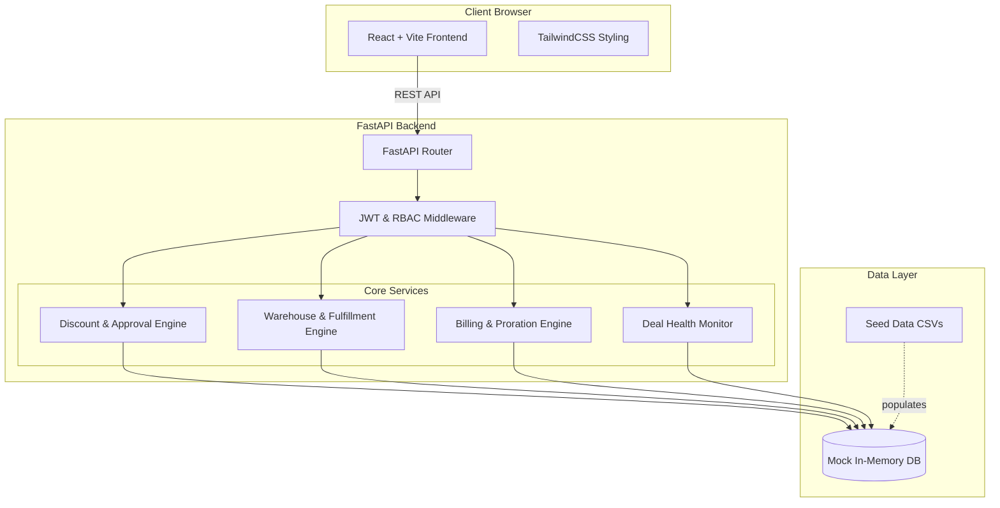
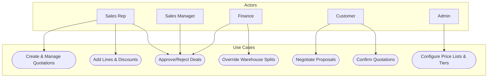
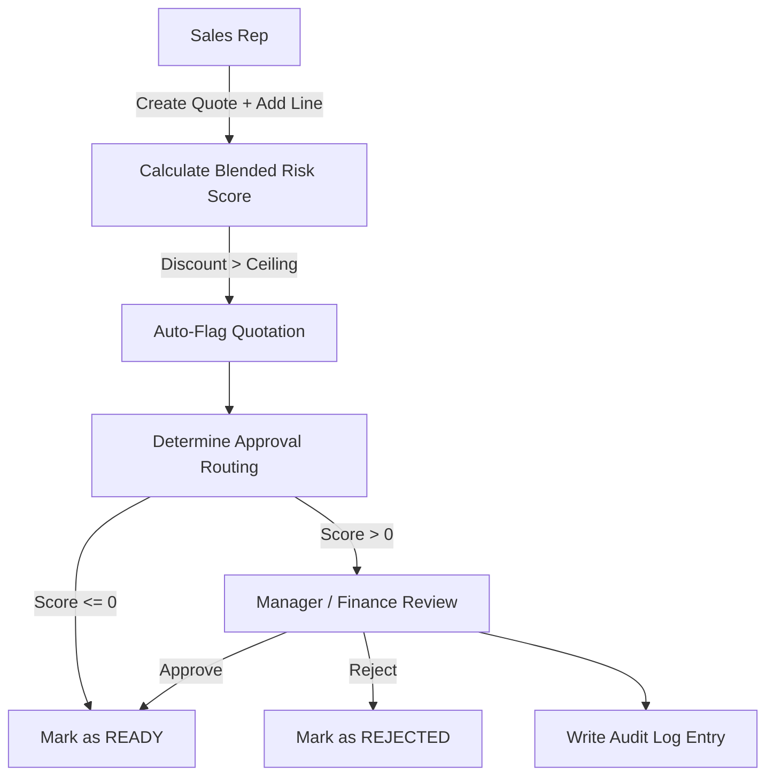
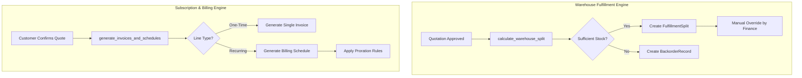

# DealFlow360 - B2B Sales Operations Engine

DealFlow360 is a **self-governing B2B sales operations engine** that powers discount governance with automated approval routing, live upsell/cross-sell scoring, multi-warehouse fulfillment splitting, hybrid (one-time + recurring) billing, deal health monitoring, and a restricted customer negotiation surface. All core business rules live in strict application logic boundaries rather than being faked in the UI.

Below is the complete engineering specification, architecture map, operational walkthrough, and setup guide.

---

## Technology Stack

The platform is designed as a multi-tier client-server application with isolated boundaries:

* **Frontend:**
  * **Framework:** React 18 + Vite
  * **Styling:** TailwindCSS
  * **State Management:** React Hooks
* **Backend:**
  * **Runtime:** Python 3.11
  * **Framework:** FastAPI
  * **API Architecture:** RESTful JSON
* **Database & ORM:**
  * **Database:** Mock in-memory DB (Extensible to PostgreSQL)
  * **Seeding:** Python scripts (`seed.py`) with 16 relationally consistent CSV datasets for the Ahmedabad Enterprise Distribution Center (`AMD-DC-01`)
* **Security & Auth:**
  * **Authentication:** JSON Web Tokens (JWT) / Session cookies (magic link capable)
  * **RBAC:** Enforced strictly at the API layer

---

## Project Architecture & Specifications Index

* **[1. System Architecture & Component Models](#1-system-architecture--component-models)**
  * Technical diagrams, UML Use Cases, and Data Flow Diagrams (DFD Level 1-2).
* **[2. Interactive Feature Walkthrough](#2-interactive-feature-walkthrough)**
  * Detailed overview of the CPQ process, discount tracking, deal health monitoring, and customer portal.
* **[3. End-to-End Workflows & Business Rules](#3-end-to-end-workflows--business-rules)**
  * Tracing a quotation from creation to fulfillment and invoicing.
* **[4. Interactive Demo Accounts](#4-interactive-demo-accounts)**
  * Roles and capabilities setup.
* **[5. Installation & Service Configuration](#5-installation--service-configuration)**
  * Native setup instructions for the Python and React runtimes.
* **[6. Roadmap & Gap Analysis](#6-roadmap--gap-analysis)**
  * Details on missing enterprise capabilities and future architecture steps.

---

## 1. System Architecture & Component Models

This section maps out how client browsers, FastAPI controllers, processing modules, and data stores connect.

### Component Diagram


### Use Case Interactions
<details>
<summary>📂 Click to expand Use Case Diagram</summary>


</details>

### Multi-Level Data Flow Diagrams (DFDs)

<details>
<summary>📂 Click to expand DFD Level 1 and Level 2 Subsystems</summary>

#### DFD Level 1: Quotation & Approval Engine


#### DFD Level 2: Fulfillment & Billing Engines

</details>

---

## 2. Interactive Feature Walkthrough

DealFlow360 turns B2B quoting into a governed, scalable process. Here is how every feature operates:

### Quote Creation & Discount Engine
* **Real-time Scoring**: Every line addition triggers a blended risk score recalculation. 
* **Tier Governance**: Discount ceilings are strictly enforced based on Customer Tier (Gold/Silver/Bronze) and Category limits.
* **Auto-Flagging**: Overages automatically escalate the quote to `PENDING_APPROVAL` without relying on sales rep manual requests.

### Approvals & Audit Trails
* **Multi-Tier Routing**: Deals are routed to Sales Ops, Finance, or VP Commercial Sales based on their risk score severity.
* **Immutable Logs**: Every approval action, rejection, or discount override writes an audit log specifying the actor, timestamp, and pre/post state changes.

### Fulfillment Splits & Backorders
* **Smart Splits**: Inventory is automatically sourced across warehouses (`AMD-DC-01`, etc.) based on real-time stock levels and shipping cost weightings.
* **Backorders**: Items with insufficient stock generate backorder records, allowing Finance to manually consolidate them later.

### Subscription & Hybrid Billing
* **Unified Orders**: A single quote can contain both hardware (one-time) and software (recurring SaaS) lines.
* **Proration Logic**: Changes in subscription cadences are handled by a centralized billing service, minimizing duplicate logic and errors.

### Deal Health Monitoring
* **Stalled Deals**: Quotes inactive for more than 7 days are flagged as "Churn Risk".
* **Discount Anomalies**: Highly discounted deals (Blended Risk Score > 10.0) trigger high-severity alerts.

### Customer Portal
* **Isolated Negotiation**: Customers log into a restricted view where they can only see their quotes.
* **Counter-Proposals**: Customers can propose new discounts, which automatically pushes the quote back into the internal approval engine if thresholds are exceeded.

---

## 3. End-to-End Workflows & Business Rules

1. **Server-Side Trust**: Discount approval routing is always computed server-side from live tier/category ceilings — never trusts client-submitted "requires approval" flags.
2. **Dynamic Risk**: Blended risk score recalculates on *every* line edit, not just at submit time.
3. **Live Stock Check**: Warehouse splits recalculate against live stock, not cached stock, at confirm time.
4. **Approval Re-entry**: Customer portal negotiation changes that cross approval thresholds cannot bypass the approval engine.
5. **Strict Audit**: All approval, discount override, and fulfillment override actions write an audit log entry.

---

## 4. Interactive Demo Accounts

RBAC is enforced strictly at the API layer. Use the following roles to test out the platform:

| Role | Capabilities |
|---|---|
| **Sales Rep** | CRUD own quotations, apply discounts, add upsell lines, view own status |
| **Sales Manager** | Review/approve/reject quotations over threshold; configure discount tiers |
| **Finance** | Second-level approval for high-risk discounts; manage warehouse splits |
| **Customer** | Restricted read/write (negotiate, confirm) via Customer Portal |
| **Admin** | Full config CRUD (products, price lists, warehouses); reporting access |

---

## 5. Installation & Service Configuration

### Prerequisites
* **Python**: v3.11+
* **Node.js**: v18+ (for frontend)
* **Package Managers**: pip, npm

### Backend Setup (FastAPI)
1. Initialize virtual environment and install dependencies:
   ```bash
   cd backend
   python -m venv venv
   source venv/bin/activate
   pip install fastapi uvicorn python-multipart pydantic
   ```
2. Seed the Mock Database:
   ```bash
   python seed.py
   ```
3. Run the Server:
   ```bash
   uvicorn main:app --reload --host 0.0.0.0 --port 8000
   ```
   * *API available at `http://localhost:8000`*
   * *Docs at `http://localhost:8000/docs`*

### Frontend Setup (React + Vite)
1. Install dependencies and start development server:
   ```bash
   cd src
   npm install
   npm run dev
   ```
   * *Frontend available at `http://localhost:5173`*

### Data Validation
To validate the enterprise dataset located in `seed-data/`:
```bash
python validate_seed_data.py
```

---

## 6. Roadmap & Gap Analysis

Based on an architectural review against modern enterprise systems, here is what DealFlow360 currently lacks and plans to integrate in future iterations:

* **Automated Test Suite**: Implementing `pytest` for backend API integration tests and component tests for the frontend.
* **Real-Time WebSockets**: Upgrading the REST polling mechanism to real-time WebSockets (e.g., `Socket.io` or FastAPI WebSockets) for live deal health alerts and dashboard updates.
* **Background Job Scheduler**: Adding `Celery` or `APScheduler` to run asynchronous Deal Health monitoring checks (e.g., flagging stalled deals automatically at midnight).
* **AI/LLM Integration**: Introducing an AI-powered pricing assistant (via RAG and OpenRouter/OpenAI APIs) to help Sales Reps optimize counter-proposals based on historical data.
* **Robust Database Integration**: Migrating from the mock in-memory DB to a full **PostgreSQL** schema using an ORM like SQLAlchemy or SQLModel, leveraging Materialized Views for reporting.
* **Cryptographic Audit Logs**: Enhancing the `ApprovalEvent` trail with cryptographic validation (e.g., SHA-256 block-chaining) to ensure absolute tamper-proof compliance for high-value negotiations.
