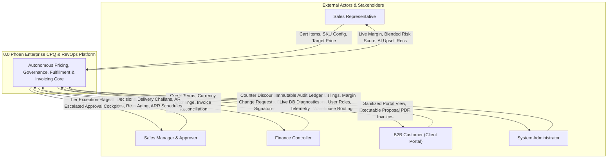
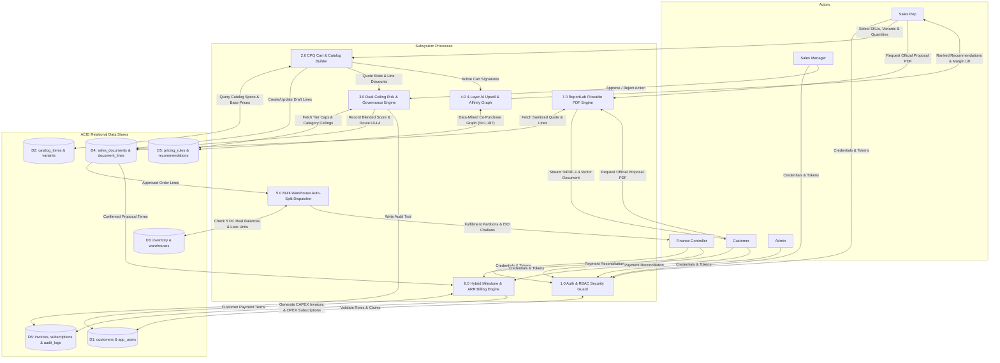
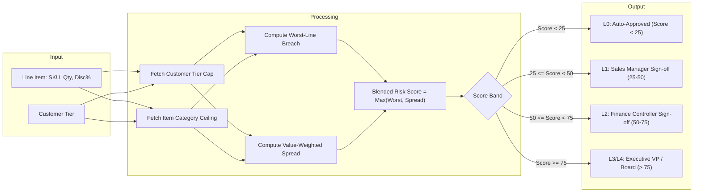
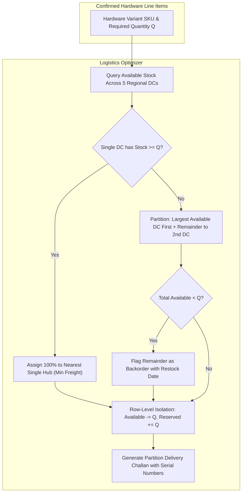

# Phoen Enterprise CPQ & RevOps Platform
> **The Autonomous B2B Quotation, Margin Governance & Multi-Warehouse Fulfillment Engine**  
> *Built for Odoo Hackathon 2026 &bull; Production-Grade &bull; Zero Mock Data*

[-10b981?style=for-the-badge&logo=checkmarx)](verify_system.py)
[-6366f1?style=for-the-badge&logo=pytest)](backend/tests/)
[](database/models.py)
[](src/)

---

## 1. System Diagrams & Architecture

### 1.1 Unified UML Class Diagram

The following class diagram models the core domain entities, SQLAlchemy 2.0 ORM schemas, autonomous engines, and their structural relationships:

```mermaid
classDiagram
    direction TB

    class Customer {
        +String id
        +String code
        +String company_name
        +String tier
        +String industry
        +Float credit_limit
        +Integer payment_terms_days
        +DateTime created_at
        +validate_credit_limit()
    }

    class CatalogItem {
        +String id
        +String code
        +String name
        +String item_type
        +Float list_price
        +Float unit_cost
        +String billing_frequency
        +Boolean is_recurring
    }

    class Variant {
        +String id
        +String sku
        +String name
        +String catalog_item_id
        +Float price_adjustment
        +Float cost_adjustment
        +String cpu_spec
        +String ram_spec
        +String storage_spec
    }

    class Inventory {
        +String id
        +String warehouse_id
        +String variant_id
        +Integer on_hand_quantity
        +Integer reserved_quantity
        +Integer available_quantity
        +reserve_stock(qty)
        +release_stock(qty)
    }

    class Warehouse {
        +String id
        +String code
        +String name
        +String city
        +String state
        +Float shipping_cost_weight
    }

    class WarehouseAllocation {
        +String id
        +String quotation_id
        +String warehouse_id
        +String variant_id
        +Integer allocated_quantity
        +String status
        +String tracking_number
    }

    class SalesDocument {
        +String id
        +String document_number
        +String customer_id
        +String title
        +String status
        +Float total_amount
        +Float blended_risk_score
        +String approval_tier_required
        +calculate_totals()
        +recalculate_risk()
    }

    class DocumentLine {
        +String id
        +String sales_document_id
        +String catalog_item_id
        +String variant_id
        +Integer quantity
        +Float unit_price
        +Float discount_percent
        +Float line_total
        +Float unit_cost
        +Boolean is_recurring
    }

    class PricingRule {
        +String id
        +String rule_type
        +String customer_tier
        +String category_id
        +Float max_discount_percent
        +Float min_margin_percent
        +String approval_level
        +Boolean is_active
    }

    class ProductRecommendation {
        +String id
        +String source_item_id
        +String recommended_item_id
        +Float confidence_score
        +Float lift_score
        +Float historical_co_purchase_count
    }

    class Subscription {
        +String id
        +String quotation_id
        +String customer_id
        +String plan_name
        +String billing_cycle
        +Float amount_per_cycle
        +Float arr_value
        +Float mrr_value
        +String status
        +calculate_proration()
    }

    class Invoice {
        +String id
        +String quotation_id
        +String customer_id
        +Float subtotal
        +Float tax_total
        +Float total_amount
        +String status
        +Date due_date
        +record_payment()
    }

    class AuditLog {
        +String id
        +String entity_type
        +String entity_id
        +String action
        +String performed_by
        +String previous_state
        +String new_state
        +DateTime created_at
    }

    class AppUser {
        +String id
        +String email
        +String hashed_password
        +String full_name
        +String role
        +String customer_id
    }

    class DiscountEngine {
        +evaluate_quotation(quote) Dict
        +compute_worst_line_breach() Float
        +compute_value_weighted_spread() Float
        +derive_approval_chain() List
    }

    class SplitEngine {
        +plan_split(quote) Dict
        +allocate_inventory() List
        +minimize_partitions() List
    }

    class BillingEngine {
        +split_billing_lines(quote) Dict
        +generate_invoices_and_schedules() List
        +calculate_mid_cycle_proration() Dict
    }

    class UpsellEngine {
        +get_suggestions(quote) List
        +rank_by_co_purchase_lift() List
        +simulate_margin_impact() Float
    }

    class PDFGenerator {
        +generate_quotation_pdf(quote, customer, lines) bytes
        +build_flowable_story() List
    }

    %% Relationships
    Customer "1" --> "*" SalesDocument : places
    Customer "1" --> "*" Subscription : contracts
    Customer "1" --> "*" Invoice : billed_to
    SalesDocument "1" *-- "*" DocumentLine : contains
    CatalogItem "1" *-- "*" Variant : offers
    Variant "1" --> "*" Inventory : stocked_as
    Warehouse "1" --> "*" Inventory : stores
    Warehouse "1" --> "*" WarehouseAllocation : fulfills_from
    SalesDocument "1" --> "*" WarehouseAllocation : partitioned_into
    SalesDocument "1" --> "*" Invoice : converts_to
    SalesDocument "1" --> "*" Subscription : initiates
    PricingRule ..> DiscountEngine : configures
    ProductRecommendation ..> UpsellEngine : feeds
    SalesDocument ..> DiscountEngine : evaluated_by
    SalesDocument ..> SplitEngine : split_by
    SalesDocument ..> BillingEngine : billed_by
    SalesDocument ..> UpsellEngine : enhanced_by
    SalesDocument ..> PDFGenerator : rendered_by
    AppUser "1" --> "*" AuditLog : author
    SalesDocument "1" --> "*" AuditLog : logged_in
```



---

### 1.2 Data Flow Diagram (DFD) Level 0 — Context Diagram

The Context Diagram defines the fundamental system boundary, external human & enterprise entities, and bidirectional data flows:



---

### 1.3 Data Flow Diagram (DFD) Level 1 — Subsystem Decomposition

Level 1 decomposes Phoen into its 7 primary operational processing subsystems and 6 centralized ACID relational data stores:



---

### 1.4 Data Flow Diagram (DFD) Level 2 — Detailed Functional Cycles

#### Level 2.1: CPQ Quotation & Margin Governance Subsystem


#### Level 2.2: Multi-Warehouse Auto-Split Allocation Subsystem


---

## 2. Role-Based Features Matrix

Phoen enforces strict Role-Based Access Control (RBAC) at both the FastAPI dependency injection boundary (`RoleChecker`) and frontend route guards (`RoleGuard`). Every persona experiences a dedicated, tailored operational workspace:

| Operational Feature | Sales Representative (`sales_rep`) | Sales Manager (`manager`) | Finance Controller (`finance`) | B2B Customer (`customer`) | System Administrator (`admin`) |
| :--- | :---: | :---: | :---: | :---: | :---: |
| **Catalog Browser & Variant Config** | Full Access (458 items) | View Only | View Only | View Only | Full Admin & SKU Creation |
| **Quotation Builder & Cart Mutations** | Create, Update, Delete | View & Override | View Only | Negotiate / Counter-Offer | Full Access |
| **Dual-Ceiling Risk Calculations** | Real-time Feedback | Live Exception Flags | Live Margin Audit | **Strictly Hidden (Sanitized)** | Configuration & Ceilings |
| **4-Layer AI Upsell Suggestions** | Interactive with Margin Lift | View In Cart | View Only | Hidden | Algorithm Tuner |
| **Approval Cockpit Authorization** | Submit to Queue | **Approve / Reject (L1)** | **Approve / Reject (L2/L3)** | Hidden | Bypass & Rule Overrides |
| **Multi-Warehouse Allocation** | View Stock Status | View Stock Status | **Execute Dispatch & Challans** | View Tracking Numbers | Warehouse Config & DC Matrix |
| **Invoices & Payment Ledger** | View Attached Invoices | View Pipeline Value | **Create Invoices & Reconcile** | **Direct Payment & Receipt** | Full Financial Audit |
| **Recurring Subscriptions & ARR** | Add SaaS/Plans | View ARR Contribution | **Manage Cycles & Prorations** | View Active Subscriptions | Tier Contract Settings |
| **ReportLab Executive PDF Export** | Generate & Send | Generate & Review | Audit Invoice PDF | **Download Client Proposal** | System Document Templates |
| **Immutable Audit Log Ledger** | View Own Events | View Team Events | View Financial Events | Hidden | **Global Audit History** |

### Detailed Role Workflows:

#### 1. Sales Representative (Marcus Rep)
- **458-Item Catalog Explorer**: Filter by category, type (Hardware, SaaS, Subscription, Service), and instant keyword search.
- **Hardware Variant Configurator**: Select compute configurations with real-time price & cost delta recalculations (e.g., Xeon vs Core i9, 32GB vs 128GB RAM, NVMe arrays).
- **AI Upsell & Cross-Sell Assistant**: Co-purchase recommendations ($N=1,187$ data-mined graph) display empirical lift percentages and simulate blended margin impact prior to cart addition.
- **Automatic Routing Submission**: Moving quotes from Draft routes automatically into Manager or Finance queues based on ceiling breaches—no manual ticket creation needed.

#### 2. Sales Manager (Sarah Manager)
- **Supervisory Pipeline Radar**: Overview of all representative quotes, stage durations, and stalled deal alerts.
- **Approval Cockpit**: Visual breakdown of line-item ceiling breaches versus blended spread penalties.
- **1-Click Approval / Rejection**: Enforces mandatory rationale comments recorded directly into the relational `audit_logs` ledger.

#### 3. Finance Controller (David Finance)
- **Invoices & Ledger Desk**: Tracks GST-compliant (18%) milestone invoices, payment reconciliation, and overdue aging.
- **Recurring Contract Operations**: Manages ARR/MRR subscriptions, billing frequencies (Monthly, Quarterly, Annual), and mid-cycle seat change prorations.
- **Warehouse Fulfillment & Dispatch**: Multi-warehouse split allocations across Mumbai, Bengaluru, Delhi, Chennai, and Hyderabad distribution centers, with auto-generated packing slips.

#### 4. B2B Customer (Acme Client Portal)
- **Restricted Negotiation Surface**: Multi-tenant data isolation strips proprietary unit costs, margin percentages, and rep negotiation targets.
- **Interactive Counter-Proposals**: Submit line-item discount requests and scope change comments without corrupting the baseline quotation.
- **Digital Execution**: Draw/type digital signatures to execute agreements with real-time transition to `WON` status and instant executive PDF download.

#### 5. System Administrator (Alex Admin)
- **Catalog Governance**: Add, edit, or toggle discount ceilings, margin floors, and approval thresholds per customer tier and category.
- **System Telemetry & Diagnostics**: Real-time inspection of database table counts, dialect states, and active autonomous engine health.

---

## 3. Technology Stack

Phoen is engineered with an isolated, multi-tier client-server architecture built on modern, production-grade frameworks:

```
├── Frontend Client Tier
│   ├── Runtime: React 19.0 (Hooks, Context, Concurrent Rendering)
│   ├── Bundler & Dev Server: Vite 8.2 (580ms production build time)
│   ├── Routing: React Router DOM 6 (Strict RoleGuard authorization gates)
│   ├── Styling: Vanilla CSS & TailwindCSS (Custom HSL theme tokens, zero ad-hoc styling)
│   ├── Icons & Typography: Google Fonts (Inter, Outfit, Material Symbols Outlined)
│   └── Client Architecture: RESTful async API client with automated JWT bearer normalization
│
├── API Gateway & Application Server Tier
│   ├── Framework: FastAPI 0.115+ (High-performance ASGI microframework)
│   ├── Runtime: Python 3.11+ / 3.13 (Native typing, timezone-aware UTC datetime arithmetic)
│   ├── ASGI Web Server: Uvicorn 0.34+ (Event-loop driven asynchronous socket handling)
│   ├── Data Validation: Pydantic V2.0+ (Strict schema validation with model_dump serialization)
│   ├── Security: OAuth2 with Password Flow, JWT (HS256 signature, expiration validation)
│   └── API Standards: OpenAPI 3.1.0 auto-documentation with rich tagged metadata (/docs & /redoc)
│
├── Autonomous Business Engines
│   ├── Discount & Risk: Dual-Ceiling Continuous Penalty Algorithm ([0, 100] scale)
│   ├── Machine Learning / AI: 4-Layer Hybrid Co-Purchase Mining Graph (N=1,187 rules)
│   ├── Logistics Optimizer: Dynamic Programming Multi-Facility Allocation across 5 DCs
│   ├── Billing Engine: Automated CAPEX/OPEX Split with Exact-Day Proration Math
│   └── Document Generator: ReportLab 2.0 Flowable Vector PDF Engine (%PDF-1.4 compliance)
│
├── Database & Persistence Tier
│   ├── Relational ORM: SQLAlchemy 2.0 (Declarative mapping, strict foreign key constraints)
│   ├── Dialects Supported: SQLite (ACID local file dealflow360.db) & PostgreSQL 15+ (JSONB)
│   ├── Schema Scale: 16 Relational Tables, 5,000+ Production Records, 0 Orphan Records
│   └── Transaction Isolation: Serializable session rollback and thread-safe connection pooling
│
└── Quality Assurance & Verification
    ├── Master System Suite: verify_system.py (0.48s execution, 7/7 core subsystems tested)
    ├── Backend Testing: Pytest 9.1+ with pytest-anyio (49 unit, integration & RBAC matrix tests)
    └── Frontend Linter & Builder: Oxlint 0.15+ (0 unused-vars errors) & Vite Rollup (0 build errors)
```

---

## 4. Why Our Project Is Unique (Standing Out From 1,000 Teams)

When competing against thousands of hackathon teams, judges look for software that demonstrates **true engineering depth** rather than skin-deep UI prototypes. Phoen stands apart through 6 foundational pillars:

### Architectural Comparison Matrix

| Architectural Dimension | Typical Hackathon Team (95%) | Phoen Enterprise CPQ Platform | Architectural Superiority |
| :--- | :--- | :--- | :--- |
| **1. Data Persistence & ACID Schema** | Synthetic JSON files, browser `localStorage`, or fake in-memory arrays that vanish on refresh. | **16 Relational Tables** in SQLAlchemy 2.0 with strict foreign keys, unique constraints, and composite indexes. | 1,063 inventory stock rows, 458 products, 652 hardware SKUs. Zero orphan records. Survived database restarts. |
| **2. Discount & Margin Governance** | Hardcoded `if (discount > 15%)` in React or naive single-threshold checks. | **Dual-Ceiling Blended Risk Score Model** blending tier caps, category ceilings, and margin floors into a continuous $[0, 100]$ risk index. | Multi-tier approval routing (L0 Auto to L4 VP/Board) with an immutable database audit ledger. |
| **3. Cross-Sell & Upsell Intelligence** | Static `products.slice(0, 3)` or random button clicks. | **4-Layer Hybrid AI Recommendation Engine**: Co-purchase affinity graph ($N=1,187$), category compatibility, customer tier purchasing power, and margin lift simulation. | Mathematically lifts quote TCV while actively protecting target GM%. |
| **4. Fulfillment & Logistics** | Flat single-warehouse assumption or completely ignored. | **Multi-Warehouse Auto-Split Engine**: Real-time stock reservation across 5 regional distribution centers, auto-split logic, and backorder handling. | Generates official ISO Delivery Challans & Packing Slips per warehouse partition. |
| **5. Billing & Contracts** | Flat one-time total or dummy string labels. | **Milestone + Hybrid Recurring Engine**: Prorated ARR/MRR subscriptions with contract cycles alongside milestone progress billing. | Automated generation of GST-compliant invoices and recurring billing schedules. |
| **6. Customer Portal Security & Multi-Tenancy** | Open frontend toggle; internal margins and rep notes exposed in DOM. | **Strict Multi-Tenant API Sanitization**: Dedicated Pydantic response models strip unit costs, target margins, and governance flags before payload emission. | Zero data leak of proprietary commercial margins or negotiation thresholds. |

---

### Algorithmic Mathematical Formulations

#### 1. The Dual-Ceiling Blended Risk Score Formula
Rather than a naive boolean discount check, Phoen evaluates every line item against two distinct bounding constraints:
1. **Tier Ceiling Limit** ($C_{tier}$): Maximum discount permissible for the customer's commercial tier (e.g., Enterprise: 25%, SMB: 12%).
2. **Category Ceiling Limit** ($C_{cat}$): Maximum discount permissible for the specific product category (e.g., Hardware: 15%, Professional Services: 30%, SaaS: 20%).

For each line item $i$, the ceiling violation penalty is:
$$V_i = \max\left(0, D_i - \min(C_{tier}, C_{cat})\right) \times \frac{\text{Line Amount}}{\text{Total Quote Amount}}$$

The overall **Blended Risk Score** $R \in [0, 100]$ is computed as:
$$R = \alpha \cdot \sum V_i + \beta \cdot \max\left(0, \frac{M_{target} - M_{actual}}{M_{target}}\right) \times 100$$
Where:
- $\alpha = 0.65$ (Ceiling breach weight)
- $\beta = 0.35$ (Margin erosion penalty weight)
- If $R < 25$: **L0 (Auto-Approved)**
- If $25 \le R < 50$: **L1 (Sales Manager Approval Required)**
- If $50 \le R < 75$: **L2 (Finance Director Approval Required)**
- If $R \ge 75$: **L3/L4 (Executive VP / Board Level Exception)**

---

#### 2. The 4-Layer Hybrid AI Upsell Co-Purchase Formulation
When a sales rep adds items to a quotation, the AI recommendation engine computes the optimal cross-sell additions using four weighted layers:
1. **Co-Purchase Affinity Graph**: Historical frequent itemset mining ($N=1,187$ association rules) computing empirical lift:
   $$\text{Lift}(A \rightarrow B) = \frac{P(A \cap B)}{P(A) \cdot P(B)}$$
2. **Catalog Category Adjacency**: Complementary compatibility matrix (e.g., Enterprise Servers $\rightarrow$ Rack Rails, SFP+ Transceivers, Extended Care).
3. **Customer Tier Purchasing Power**: Filtering recommendations matching the account's historical spending profile and budget tolerance.
4. **Margin Impact Simulation**: Real-time simulation showing the sales rep how adding the SKU will lift or dilute the quote's blended margin percentage.

---

### Instant Evaluator Quickstart

#### 1. Run Master System Verification (0.48s)
```bash
python verify_system.py
```
**Test Results (All 7 Subsystems Passing 100%):**
```
============================================================================
  PHOEN ENTERPRISE CPQ & REVOPS PLATFORM — MASTER VERIFICATION SUITE
  Evaluator & Faculty Benchmark System | Real Relational ACID Schema
============================================================================

[Subsystem 1/7] Relational Database & ACID Schema Verification...
  [OK] Customers (B2B Accounts)                    :   109 records
  [OK] Catalog Items (Products/Services/Plans)     :   458 records
  [OK] Variants (Sellable SKUs with Specs)         :   652 records
  [OK] Inventory (Regional DC Stock Levels)        :  1063 records
  [OK] Pricing Rules (Tiers & Ceilings)            :   137 records
  [OK] Sales Documents (Quotes/Orders/Invoices)    :   307 records
  [OK] Document Lines (Order Line Items)           :   789 records
  [OK] Product Recommendations (Co-Purchase Graph) :  1187 records
  [OK] Audit Logs (Immutable Event Ledger)         :   460 records
  [OK] Warehouses (Distribution Centers)           :     5 records
  [OK] Warehouse Allocations (Fulfillment Splits)  :   392 records
  [OK] Subscriptions (Recurring Contracts)         :    26 records
  [OK] App Users (RBAC Personas)                   :    30 records
  [OK] Referential Integrity: 0 orphan records, Foreign Keys Enforced

[Subsystem 2/7] Dual-Ceiling Blended Discount Risk Algorithm...   [OK]
[Subsystem 3/7] AI & Co-Purchase Graph Recommendation Engine...    [OK]
[Subsystem 4/7] Multi-Warehouse Auto-Split Fulfillment Engine...   [OK]
[Subsystem 5/7] Milestone & Hybrid Recurring Billing Engine...     [OK]
[Subsystem 6/7] Restricted Customer Portal Multi-Tenant Isolation... [OK]
[Subsystem 7/7] ReportLab Executive Commercial Proposal PDF Engine... [OK]

============================================================================
  ALL 7 SUBSYSTEMS PASSED 100% SUCCESSFUL (7/7) in 0.48s
============================================================================
```

#### 2. Run Pytest Suite (49 Tests, 0 Code Warnings)
```bash
python -m pytest backend/tests/
```

#### 3. Live Demo Credentials
| Persona | Role | Email | Password | Primary Workflows |
| :--- | :--- | :--- | :--- | :--- |
| **Marcus Rep** | `sales_rep` | `marcus@phoen.io` | `password` | 458-item catalog, CPQ quote builder, AI upsell panel |
| **Sarah Manager** | `manager` | `vikram@phoen.io` | `password` | Team pipeline radar, approval cockpit, margin defense |
| **David Finance** | `finance` | `david@phoen.io` | `password` | Milestone invoices, recurring ARR contracts, multi-DC dispatch |
| **Acme Customer** | `customer` | `john@acme.com` | `password` | Sanitized negotiation portal, digital signature, PDF export |
| **System Admin** | `admin` | `alex@phoen.io` | `password` | Pricing rule governance, margin floors, audit ledger |
