# Table Reduction Plan: From 25 to 11 Physical Tables

## 1. Reduction Strategy Overview
The table reduction plan systematically consolidates 25 physical tables into 11 high-performance core relational tables without losing any business data, relational consistency, or query speed.

```mermaid
flowchart TD
    subgraph Master Entities
        PR[products] --> CI[catalog_items]
        SR[services] --> CI
        SP[subscription_plans] --> CI
        BR[brands] --> CI
        PV[product_variants] --> VR[variants]
        CAT[categories] --> CAT_R[categories]
        CUST[customers] --> CUST_R[customers]
    end

    subgraph Inventory & Warehousing
        WH[warehouses] --> WH_R[warehouses]
        INV[inventory] --> INV_R[inventory]
        WA[warehouse_allocations] --> DL[document_lines]
    end

    subgraph Pricing & Rules
        PL[price_lists] --> PRU[pricing_rules]
        CPL[customer_price_lists] --> PRU
        DR[discount_rules] --> PRU
        AC[approval_chains] --> PRU
    end

    subgraph Transaction Documents
        QT[quotations] --> SD[sales_documents]
        ORD[orders] --> SD
        INV_DOC[invoices] --> SD
        QL[quotation_lines] --> DL
        IL[invoice_lines] --> DL
        NEG[negotiations] --> DL
    end

    subgraph Recurring & Audit
        SUB[subscriptions] --> SUB_R[subscriptions]
        AUD[audit_logs] --> AUD_R[audit_logs]
        DH[deal_health] -.->|View / JSONB| SD
        REC[product_recommendations] -.->|View / JSONB| CI
        PSR[product_service_rules] -.->|JSONB Rules| CI
    end
```

---

## 2. Consolidation Actions by Domain

### Group A: Catalog & Product Master Consolidation (5 Tables $\rightarrow$ 2 Tables)
1. **Consolidate Products and Services into `catalog_items`**:
   - `products` (361 rows) and `services` (41 rows) have 85% overlapping schema.
   - We merge both into `catalog_items` using `item_type IN ('PRODUCT', 'SERVICE', 'SUBSCRIPTION_PLAN')`.
   - Brand information from `brands` (34 rows) is flattened directly into `catalog_items` (`brand_name`, `brand_code`), eliminating a foreign key join across all catalog lookups.
   - For backward compatibility, views `v_products`, `v_services`, and `v_brands` are created.
2. **Compress Product Variants into `variants`**:
   - `product_variants` (652 rows) retains its primary sellable SKU columns: `id`, `catalog_item_id`, `sku`, `name`, `extra_price`, `cost_price`, `selling_price`, `barcode`, `status`.
   - The 10 rigid hardware columns (`cpu`, `ram`, `storage`, `gpu`, `screen_size`, etc.) are compressed into a validated, GIN-indexed `attributes JSONB` column.
   - Result: 100% SKU granularity preserved, zero schema migrations needed for new hardware types.

### Group B: Document Header & Line Item Consolidation (7 Tables $\rightarrow$ 2 Tables)
1. **Consolidate Quotations, Orders, and Invoices into `sales_documents`**:
   - `quotations` (180 rows), `orders` (45 rows), and `invoices` (56 rows) represent 3 sequential states of a single sales document flow.
   - Unified into `sales_documents` with:
     - `document_type`: `'QUOTATION'`, `'ORDER'`, `'INVOICE'`
     - `parent_document_id`: Self-referencing FK linking Quotation $\rightarrow$ Order $\rightarrow$ Invoice.
     - Unified financial totals: `subtotal`, `discount_total`, `tax_total`, `grand_total`.
     - `deal_health`: Algorithmic health metrics stored as a structured JSONB snapshot on quote documents.
   - Compatibility views `v_quotations`, `v_orders`, and `v_invoices` provide exact drop-in replacements.
2. **Consolidate Quotation Lines, Invoice Lines, and Negotiations into `document_lines`**:
   - `quotation_lines` (455 rows) and `invoice_lines` (260 rows) are consolidated into `document_lines`.
   - `negotiations` (36 rows) counter-proposals are embedded into `document_lines.negotiation_data` JSONB.
   - `warehouse_allocations` (392 rows) stock reservation flags are merged into `document_lines.warehouse_id`, `document_lines.allocated_quantity`, and `document_lines.fulfillment_status`.

### Group C: Pricing, Discounts, and Approval Consolidation (4 Tables $\rightarrow$ 1 Table)
1. **Consolidate Pricing Entities into `pricing_rules`**:
   - `price_lists` (4 rows): Merged with `rule_type = 'PRICE_LIST'` and `scope_type = 'TIER'`.
   - `customer_price_lists` (100 rows): Merged with `rule_type = 'CUSTOMER_OVERRIDE'` and `scope_type = 'CUSTOMER'`.
   - `discount_rules` (28 rows): Merged with `rule_type = 'DISCOUNT_LIMIT'`.
   - `approval_chains` (5 rows): Merged as discount approval tiers or stored in `pricing_rules.approval_config`.
   - Benefit: A single unified price and discount calculation query instead of 3 sequential table lookups.

### Group D: Recommendations & Derived Entities (3 Tables $\rightarrow$ 0 Physical Tables)
1. **Deal Health**: Converted to PostgreSQL View `v_deal_health` + JSONB snapshot on `sales_documents`.
2. **Product Recommendations**: Converted to on-demand SQL View `v_product_recommendations` and cached in `catalog_items.metadata`.
3. **Product Service Rules**: Converted into JSONB rule arrays inside `catalog_items.metadata->'service_rules'`.

---

## 3. Physical Table Reduction Count

$$\text{Current Tables: } 25 \quad \longrightarrow \quad \text{Target Tables: } 11 \quad (\Delta = -14 \text{ tables}, -56\%)$$
$$\text{New Tables Created: } 0$$
$$\text{Preserved Row Count: } 5,269 \text{ rows} \quad (100\% \text{ data preservation})$$
