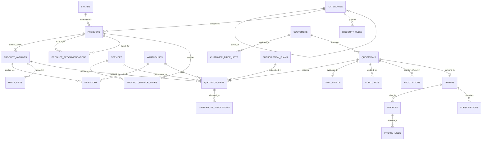

# DealFlow360 — Production-Quality Mumbai Enterprise IT Hardware Seed Dataset

## 1. Executive Summary & Dataset Purpose

This dataset provides a production-grade, relationally consistent, synthetic enterprise IT procurement data suite designed specifically for **DealFlow360**, an enterprise B2B Sales Operations, CPQ (Configure, Price, Quote), and Deal Management platform.

The dataset models a tier-1 Indian enterprise technology distributor, corporate systems integrator, and IT logistics provider headquartered in **Mumbai, Maharashtra, India**. The fulfillment infrastructure is anchored around:
- **Primary Distribution Center (`MUM-DC-01`)**: Mumbai Enterprise Technology Distribution Center, MIDC Industrial Area, Andheri East, Mumbai 400093 (180,000 unit capacity).
- **Secondary Logistics Hub (`NAVI-MUM-DC-01`)**: Navi Mumbai Staging & Logistics Hub, Mahape / TTC Industrial Area, Navi Mumbai 400710 (100,000 unit capacity).
- **Supporting Regional Depots**:
  - `BLR-DC-01`: Bengaluru Tech Fulfillment Depot, Electronic City, Bengaluru (75,000 unit capacity)
  - `DEL-DC-01`: Delhi NCR Enterprise Supply Hub, Udyog Vihar, Gurugram (85,000 unit capacity)
  - `HYD-DC-01`: Hyderabad Cyber Logistics Center, HITEC City, Hyderabad (60,000 unit capacity)

All prices, part numbers, component specifications, customer profiles, discount governance matrices, upsell attachment rules, and warehouse allocations reflect authentic Indian commercial hardware procurement conventions (in Indian Rupees — INR, ₹).

---

## 2. Dataset Entity Overview & Record Counts

The Mumbai dataset comprises **25 relational CSV tables**, spanning **361 unique products**, **652 sellable SKUs**, **100 enterprise accounts**, **995 inventory allocations**, **100 enterprise quotations**, and **455 quotation line items**.

| CSV File | Entity Description | Record Count | Primary Key | Key Foreign Key References |
|---|---|:---:|---|---|
| [`brands.csv`](file:///c:/Users/Krishna/Desktop/odoo/seed_data/mumbai/brands.csv) | Tier-1 Hardware OEMs & Enterprise Software Vendors | **34** | `brand_id` | Referenced by `products.brand_id` |
| [`categories.csv`](file:///c:/Users/Krishna/Desktop/odoo/seed_data/mumbai/categories.csv) | Hierarchical Product Taxonomy (4 Parent + 14 Leaf) | **18** | `category_id` | Self-referencing `parent_category_id` |
| [`warehouses.csv`](file:///c:/Users/Krishna/Desktop/odoo/seed_data/mumbai/warehouses.csv) | Distribution Centers & Regional Fulfillment Depots | **5** | `warehouse_id` | Referenced by `inventory`, `quotation_lines`, `allocations` |
| [`services.csv`](file:///c:/Users/Krishna/Desktop/odoo/seed_data/mumbai/services.csv) | Deployment, Migration, Low-Latency Networking & Staging | **42** | `service_id` | Referenced by `quotation_lines`, `service_rules` |
| [`subscription_plans.csv`](file:///c:/Users/Krishna/Desktop/odoo/seed_data/mumbai/subscription_plans.csv) | Recurring AMC, Cloud Backup, SOC & MDM Plans | **22** | `plan_id` | Referenced by `quotation_lines`, `subscriptions` |
| [`discount_rules.csv`](file:///c:/Users/Krishna/Desktop/odoo/seed_data/mumbai/discount_rules.csv) | Multi-tier discount limits, margin floors & escalation paths | **28** | `discount_rule_id` | `category_id`, `customer_tier` |
| [`approval_chains.csv`](file:///c:/Users/Krishna/Desktop/odoo/seed_data/mumbai/approval_chains.csv) | Multi-level approval escalation workflows | **5** | `chain_id` | Referenced by governance processes |
| [`customers.csv`](file:///c:/Users/Krishna/Desktop/odoo/seed_data/mumbai/customers.csv) | Mumbai Enterprise Accounts (BFSI, HFT, Media, Conglomerates) | **100** | `customer_id` | Referenced by `quotations`, `price_lists`, `invoices` |
| [`products.csv`](file:///c:/Users/Krishna/Desktop/odoo/seed_data/mumbai/products.csv) | Enterprise IT Hardware & Infrastructure Families | **361** | `product_id` | `category_id`, `subcategory_id`, `brand_id` |
| [`product_variants.csv`](file:///c:/Users/Krishna/Desktop/odoo/seed_data/mumbai/product_variants.csv) | Commercial SKUs with CPU/RAM/Storage/Chassis Specs | **652** | `variant_id` | `product_id` |
| [`inventory.csv`](file:///c:/Users/Krishna/Desktop/odoo/seed_data/mumbai/inventory.csv) | Stock levels across 5 Warehouses (On-hand, Reserved, Backorder) | **995** | `inventory_id` | `warehouse_id`, `variant_id` |
| [`price_lists.csv`](file:///c:/Users/Krishna/Desktop/odoo/seed_data/mumbai/price_lists.csv) | 4 Commercial Pricing Tiers (Standard, SMB, Ent, Strategic) | **2,608** | `(price_list_id, product_variant_id)` | `product_variant_id` |
| [`customer_price_lists.csv`](file:///c:/Users/Krishna/Desktop/odoo/seed_data/mumbai/customer_price_lists.csv) | Customer Price List Assignments & Payment Terms | **100** | `customer_price_id` | `customer_id`, `price_list_id` |
| [`product_recommendations.csv`](file:///c:/Users/Krishna/Desktop/odoo/seed_data/mumbai/product_recommendations.csv) | Intelligent Upsell, Cross-Sell & Hardware Attachments | **744** | `recommendation_id` | `source_product_id`, `recommended_product_id` |
| [`product_service_rules.csv`](file:///c:/Users/Krishna/Desktop/odoo/seed_data/mumbai/product_service_rules.csv) | Automated Deployment & Warranty Service Attachments | **375** | `rule_id` | `product_id`, `service_id` |
| [`quotations.csv`](file:///c:/Users/Krishna/Desktop/odoo/seed_data/mumbai/quotations.csv) | Commercial B2B Quotations across Lifecycle Stages | **100** | `quotation_id` | `customer_id` |
| [`quotation_lines.csv`](file:///c:/Users/Krishna/Desktop/odoo/seed_data/mumbai/quotation_lines.csv) | Hardware, Service & Recurring Subscription Line Items | **455** | `line_id` | `quotation_id`, `product_variant_id`, `service_id`, `subscription_plan_id`, `fulfillment_warehouse_id` |
| [`negotiations.csv`](file:///c:/Users/Krishna/Desktop/odoo/seed_data/mumbai/negotiations.csv) | Counter-Offers & Negotiation Portal Records | **36** | `negotiation_id` | `quotation_id`, `customer_id`, `quotation_line_id` |
| [`customer_negotiations.csv`](file:///c:/Users/Krishna/Desktop/odoo/seed_data/mumbai/customer_negotiations.csv) | Alias Mirror of Negotiation Records | **36** | `negotiation_id` | `quotation_id`, `customer_id`, `quotation_line_id` |
| [`deal_health.csv`](file:///c:/Users/Krishna/Desktop/odoo/seed_data/mumbai/deal_health.csv) | Deal Health Scores, Margins, Velocity & Anomaly Signals | **100** | `deal_health_id` | `quotation_id` |
| [`audit_logs.csv`](file:///c:/Users/Krishna/Desktop/odoo/seed_data/mumbai/audit_logs.csv) | Immutable Audit Trail of Approvals, Edits & State Changes | **165** | `audit_id` | `quotation_id` |
| [`invoices.csv`](file:///c:/Users/Krishna/Desktop/odoo/seed_data/mumbai/invoices.csv) | Post-Sale Tax Invoices (Paid, Pending, Overdue) | **56** | `invoice_id` | `order_id`, `customer_id` |
| [`invoice_lines.csv`](file:///c:/Users/Krishna/Desktop/odoo/seed_data/mumbai/invoice_lines.csv) | Detailed Line Breakdown for Financial Invoices | **260** | `invoice_line_id` | `invoice_id`, `product_variant_id`, `service_id` |
| [`orders.csv`](file:///c:/Users/Krishna/Desktop/odoo/seed_data/mumbai/orders.csv) | Confirmed Sales Orders Executed from Approved Quotations | **45** | `order_id` | `quotation_id`, `customer_id` |
| [`warehouse_allocations.csv`](file:///c:/Users/Krishna/Desktop/odoo/seed_data/mumbai/warehouse_allocations.csv) | Real-time Multi-Warehouse Reserve & Dispatch Allocations | **392** | `allocation_id` | `quotation_id`, `quotation_line_id`, `variant_id`, `warehouse_id` |
| [`subscriptions.csv`](file:///c:/Users/Krishna/Desktop/odoo/seed_data/mumbai/subscriptions.csv) | Active Recurring Service Contracts Provisioned from Orders | **26** | `subscription_id` | `order_id`, `customer_id`, `plan_id` |

---

## 3. Entity Relationship Architecture



---

## 4. Mumbai Warehouse Architecture & Multi-DC Topology

The dataset implements a multi-tier fulfillment topology centered on the Mumbai metropolitan economic corridor:

### Primary Distribution Center
- **Warehouse ID**: `WH-001`
- **Warehouse Code**: `MUM-DC-01`
- **Name**: Mumbai Enterprise Technology Distribution Center
- **Address**: Plot No. B-14, MIDC Central Road, Andheri East, Mumbai 400093, Maharashtra
- **Capacity**: 180,000 units
- **Manager**: Rajeshwar Varma (`rajeshwar.varma@dealflow360.internal`, +91 98201 54321)
- **Role**: Primary central repository holding core stock for all 652 sellable SKUs. Handles 85%+ of Mumbai commercial despatches and high-density computing deployments.

### Secondary Logistics Hub
- **Warehouse ID**: `WH-002`
- **Warehouse Code**: `NAVI-MUM-DC-01`
- **Name**: Navi Mumbai Staging & Logistics Hub
- **Address**: TTC Industrial Area, MIDC Pawane / Mahape, Navi Mumbai 400710, Maharashtra
- **Capacity**: 100,000 units
- **Manager**: Tanvi Deshmukh (`tanvi.deshmukh@dealflow360.internal`, +91 98202 87654)
- **Role**: Buffer storage, corporate mobility staging, imaging facility, and multi-hub overflow fulfillment center.

### Regional Supporting Warehouses
- **`WH-003` (`BLR-DC-01`)**: Bengaluru Tech Fulfillment Depot, Electronic City Phase 1, Bengaluru 560100 (Capacity: 75,000 units)
- **`WH-004` (`DEL-DC-01`)**: Delhi NCR Enterprise Supply Hub, Udyog Vihar Phase 4, Gurugram 122016 (Capacity: 85,000 units)
- **`WH-005` (`HYD-DC-01`)**: Hyderabad Cyber Logistics Center, HITEC City, Hyderabad 500081 (Capacity: 60,000 units)

---

## 5. Product Taxonomy & Catalog Breakdown

The catalog spans **361 unique products** across 4 primary divisions and 14 enterprise subcategories, expanded into **652 production-ready variants**:

### 1. Computing (`CAT-COMP`)
- **Business Laptops (`CAT-LAP`, 50 products / 100 variants)**: Dell Latitude 3440/5440/7440, ThinkPad T14 Gen 4 / X1 Carbon Gen 11 / L14, HP EliteBook 840/640 G10, Apple MacBook Pro 14/16 (M3/M3 Pro/M3 Max), MacBook Air M2/M3, ASUS ExpertBook B5/B9.
- **Business Desktops (`CAT-DSK`, 30 products / 60 variants)**: Dell OptiPlex 7010 Micro / Small Form Factor / Tower / All-in-One, Lenovo ThinkCentre M70q Tiny / M70s SFF, HP ProDesk 400 / EliteDesk 800 G9 Mini.
- **Enterprise Workstations (`CAT-WKS`, 25 products / 50 variants)**: Dell Precision 3660 / 5860 Tower / 7960 Rack, HP Z2 / Z4 / Z8 Fury G5, Lenovo ThinkStation P3 / P5 / PX dual-Xeon workhorses.

### 2. Infrastructure (`CAT-INFRA`)
- **Rack & Tower Servers (`CAT-SRV`, 30 products / 60 variants)**: Dell PowerEdge R450 / R660 / R760 / T360, HPE ProLiant DL360 / DL380 Gen11, Lenovo ThinkSystem SR630 / SR650 V3, High-Density 2U Dual Socket Compute.
- **Enterprise Networking (`CAT-NET`, 30 products / 60 variants)**: Cisco Catalyst 9200L / 9300 24/48-Port UPOE StackWise switches, Aruba CX 6100 / 6200F, Ubiquiti UniFi U6-Pro / U6-Enterprise APs, FortiGate 60F / 100F Next-Gen Firewalls.
- **Storage & Backup (`CAT-STO`, 25 products / 50 variants)**: Synology DiskStation DS923+ / RS2423+ RP Rackmount NAS, QNAP TS-464, Western Digital Ultrastar DC HC550 16TB/20TB Enterprise SAS/SATA drives, Samsung PM893 / PM1733 NVMe U.2 Enterprise SSDs.
- **Enterprise UPS & Power (`CAT-UPS`, 20 products / 40 variants)**: APC Smart-UPS 1.5kVA / 3kVA / 5kVA / 10kVA Online Double-Conversion Rackmount UPS with Network Management Card, Eaton 5P / 9PX, Vertiv Liebert GXT5.

### 3. Mobility (`CAT-MOB`)
- **Enterprise Smartphones (`CAT-SMP`, 22 products / 44 variants)**: Apple iPhone 15 / 15 Pro / 16 / 16 Pro Max, Samsung Galaxy S24 / S24 Ultra / Galaxy Z Fold5 / A55 Enterprise Edition, Google Pixel 8 Pro, Motorola Edge 50 Pro.
- **Business Tablets (`CAT-TAB`, 20 products / 38 variants)**: Apple iPad 10th Gen, iPad Air M2, iPad Pro M4 (11" & 13"), Samsung Galaxy Tab S9 Enterprise Edition, Galaxy Tab Active4 Pro Rugged with S-Pen.

### 4. Peripherals, Displays & Collaboration (`CAT-PERIPH`)
- **Monitors & Trading Displays (`CAT-MON`, 30 products / 40 variants)**: Dell UltraSharp U2424H, U2724D 120Hz IPS Black, U3224KB 6K, HP E24 G4 / E27q G5, ThinkVision T27h USB-C Hub, Samsung ViewFinity S9 5K.
- **Enterprise Office Printers (`CAT-PRN`, 18 products / 24 variants)**: HP LaserJet Pro M404dn / MFP M428fdw, Canon imageCLASS LBP226dw / imageRUNNER A3 MFP, Brother HL-L6400DW Enterprise Monoprinter.
- **Accessories & Docking (`CAT-ACC`, 25 products / 30 variants)**: Dell WD19S 180W, Dell WD22TB4 Thunderbolt 4 Modular Dock, Lenovo ThinkPad Universal Thunderbolt 4 Dock, HP USB-C G5 Essential Dock, Logitech MX Master 3S, Jabra Evolve2 65 MS Wireless ANC Headset.
- **Meeting Room Collaboration (`CAT-COL`, 20 products / 20 variants)**: Logitech Rally Bar / Rally Bar Mini / MeetUp, Poly Studio X50 / X70 All-in-One 4K Video Bars, Barco ClickShare CX-30 / CX-50 Gen 2 Wireless Presentation Systems.
- **Enterprise Cabling & Optics (`CAT-SEC`, 16 products / 16 variants)**: Cisco 10G SFP+ SR / LR Optical Transceivers, Aruba 10G SFP+ Direct Attach Copper (DAC) Cables, Belkin Cat6A 500MHz Shielded Patch Cord 10-Packs, Dell & HPE 2U ReadyRails Sliding Server Rail Kits.

---

## 6. Mumbai Customer Ecosystem & Geographic Clusters

The dataset models **100 authentic Mumbai enterprise accounts** distributed across primary economic zones and industry clusters:

### Key Geographic Clusters:
1. **Bandra-Kurla Complex (BKC)**: Prime financial epicenter housing national private banks, sovereign wealth funds, Tier-1 NBFCs, foreign investment banks, and corporate headquarters (e.g., *Meridian Capital Advisors*, *Apex Global Analytics*, *Kotak Infrastructure*, *Tata Digital*).
2. **Nariman Point & Fort**: Historic financial district hosting established equity brokerages, admiralty law firms, maritime underwriters, and charter services (e.g., *Bharat Financial Securities*, *Zenith Legal Advisors*, *Falcon Aviation*).
3. **Lower Parel & Prabhadevi (Mill District Repurposed)**: Modern corporate towers (One World Center, Lodha Excelus, Marathon Futurex) hosting fintech, private equity, high-frequency trading firms, and advertising conglomerates (e.g., *Equinox Quantitative Trading*, *Prism Interactive*).
4. **Andheri East MIDC & SEEPZ**: IT services, electronics trading, pharmaceutical discovery labs, and export software units (e.g., *Novartis Discovery Labs*, *Starlight Film Studios*).
5. **Goregaon Film City & Malad Mindspace**: Media production studios, broadcast streaming networks, OTT post-production VFX facilities, and business process operations.
6. **Navi Mumbai (Mahape, Airoli, Vashi)**: Hyperscale data center parks, BPO campuses, fintech backup processing centers, and supply chain logistics hubs.
7. **Thane (Ghodbunder Road & Wagle Industrial Estate)**: Precision engineering, chemicals, and industrial automation enterprises.

### Customer Tiers:
- **Strategic Tier (15 accounts)**: Annual procurement > ₹25 Cr. Assigned to Price List `PL-MUM-STRAT` (~16% to 22% baseline discount off standard list).
- **Enterprise Tier (35 accounts)**: Annual procurement ₹5 Cr – ₹25 Cr. Assigned to Price List `PL-MUM-ENT` (~9% to 14% baseline discount).
- **SMB Tier (35 accounts)**: Annual procurement ₹50 L – ₹5 Cr. Assigned to Price List `PL-MUM-SMB` (~4% to 7% baseline discount).
- **Standard Tier (15 accounts)**: Annual procurement < ₹50 L. Assigned to Price List `PL-MUM-STD` (Standard commercial list price).

---

## 7. Commercial Governance, Pricing & Discount Matrix

### Margin Protection Philosophy
- **Unit Cost Floor**: Every variant in `price_lists.csv` strictly obeys `unit_price >= round(cost_price * 1.04, 2)`. This ensures an absolute minimum 4% gross profit margin cushion even after the deepest customer-tier discounts.
- Typical Hardware Margins: 8% to 26%
- Enterprise Networking & High-Density Compute: 16% to 32%
- Enterprise Peripherals & Accessories: 24% to 45%
- Professional Services & Managed Subscriptions: 35% to 55%

### Discount Governance Hierarchy (`discount_rules.csv` & `approval_chains.csv`)
Discounts exceeding established category thresholds trigger DealFlow360 approval workflows:

| Category | Standard Tier Ceiling | SMB Tier Ceiling | Enterprise Tier Ceiling | Strategic Tier Ceiling | Min Gross Margin Safety Floor | Escalation Level |
|---|:---:|:---:|:---:|:---:|:---:|---|
| **Laptops (`CAT-LAP`)** | 5.0% | 8.0% | 16.0% | 20.0% | 7.0% | L2 Sales Director / L3 Commercial VP |
| **Desktops (`CAT-DSK`)** | 5.0% | 8.0% | 15.0% | 18.0% | 8.0% | L2 Sales Director |
| **Workstations (`CAT-WKS`)** | 6.0% | 10.0% | 18.0% | 22.0% | 9.0% | L2 Sales Director / L3 Commercial VP |
| **Servers (`CAT-SRV`)** | 4.0% | 8.0% | 15.0% | 20.0% | 8.0% | L2 Sales Director / L4 CFO |
| **Networking (`CAT-NET`)** | 5.0% | 8.0% | 14.0% | 18.0% | 10.0% | L2 Sales Director / L3 Commercial VP |
| **Storage (`CAT-STO`)** | 4.0% | 7.0% | 12.0% | 16.0% | 9.0% | L2 Sales Director |
| **Power/UPS (`CAT-UPS`)** | 5.0% | 8.0% | 14.0% | 18.0% | 10.0% | L1 Sales Lead |
| **Smartphones (`CAT-MOB`)** | 3.0% | 5.0% | 8.0% | 12.0% | 6.0% | L3 Commercial VP |
| **Displays (`CAT-MON`)** | 6.0% | 10.0% | 18.0% | 22.0% | 11.0% | L1 Sales Lead |

### Escalation Levels:
- **`L1_SALES_LEAD`**: Concessions within 1.0% to 3.0% over tier limit.
- **`L2_SALES_DIRECTOR`**: Concessions within 3.1% to 6.0% over tier limit.
- **`L3_VP_COMMERCIAL`**: Concessions within 6.1% to 10.0% over tier limit or deals > ₹1 Crore.
- **`L4_CFO_FINANCE`**: Concessions eroding gross margins below safety floors or critical discount anomalies.

---

## 8. Embedded Demo Scenarios & Test Walkthroughs

The dataset embeds 6 core demo flows and 4 specialized multi-warehouse / deal-health scenarios with real database records:

### Demo Flow 1: Discount Governance Escalation
- **Quotation**: `QT-MUM-0001` (Quotation Number: `QT-MUM-2026-0001`)
- **Customer**: `CUST-001` (Meridian Capital Advisors Pvt Ltd, BKC)
- **Bill of Materials**:
  - 30x Dell Latitude 5440 Core i5 (`VAR-0001`) @ ₹82,000 list. Rep requested **22.0% discount** (exceeds Enterprise Hardware ceiling of 16.0% by 6.0%).
  - 30x Dell UltraSharp U2724D 27" QHD 120Hz Displays (`VAR-0249`) @ 14.0% discount.
  - 30x Dell WD19S 180W USB-C Docks (`VAR-0352`) @ 12.0% discount.
  - 30x Zero-Touch Laptop Deployment Service (`SRV-005`).
- **Database State**:
  - `quotations.status` = `'Pending Approval'`
  - `quotations.approval_status` = `'Pending L2 Finance & L3 Commercial Review'`
  - `deal_health.health_status` = `'Critical'`
  - `deal_health.discount_anomaly_score` = `78.5`

### Demo Flow 2: Intelligent Upsell & Attachment
- **Quotation**: `QT-MUM-0002` (Quotation Number: `QT-MUM-2026-0002`)
- **Customer**: `CUST-002` (Bharat Financial Securities Ltd, Nariman Point)
- **Context**: High-frequency algorithmic trading desk rollout.
- **Bill of Materials**:
  - 25x Dell Latitude 7440 Core Ultra 7 (`VAR-0006`)
  - **Attached Recommendation 1**: 25x Dell WD22TB4 Thunderbolt 4 Modular Docks (`VAR-0353`)
  - **Attached Recommendation 2**: 25x Dell UltraSharp U2724D 120Hz IPS Black Displays (`VAR-0249`)
  - **Attached Peripherals**: 25x Jabra Evolve2 65 MS Wireless ANC Headsets (`VAR-0363`)
  - **Attached Proactive Support**: 25x Comprehensive 24x7 4-Hour SLA Enterprise Hardware AMC (`SUB-001`)
- **Database State**: Status `'Approved'`, Grand Total ₹74,00,960.00, Deal Health `'Healthy'`.

### Demo Flow 3: Multi-DC Split Fulfillment
- **Quotation**: `QT-MUM-0003` (Quotation Number: `QT-MUM-2026-0003`)
- **Customer**: `CUST-003` (Apex Global Analytics Solutions, BKC)
- **Bill of Materials**: 80x Lenovo ThinkPad T14 Gen 4 (`VAR-0011`).
- **Warehouse Fulfillment Split**:
  - **Line 1 (`QL-00010`)**: 50 units fulfilled from Mumbai Central DC (`WH-001` / `MUM-DC-01`), `fulfillment_status` = `'ALLOCATED'`.
  - **Line 2 (`QL-00011`)**: 30 units split fulfilled from Bengaluru Hub (`WH-003` / `BLR-DC-01`), `fulfillment_status` = `'PARTIAL_SPLIT'`.
- **Database Verification**: Referenced in `warehouse_allocations.csv` as `WALLOC-00008` (`WH-001`, qty 50) and `WALLOC-00009` (`WH-003`, qty 30).

### Demo Flow 4: Backorder Management & Split Allocation
- **Quotation**: `QT-MUM-0004` (Quotation Number: `QT-MUM-2026-0004`)
- **Customer**: `CUST-004` (Kotak Infrastructure Services Ltd, BKC)
- **Bill of Materials**: 20x Dell PowerEdge R760 2U Enterprise Rack Servers (`VAR-0134`).
- **Inventory Allocation**:
  - **Line 1 (`QL-00013`)**: 12 units immediate stock allocation from `WH-001`, `fulfillment_status` = `'ALLOCATED'`.
  - **Line 2 (`QL-00014`)**: 8 units OEM factory backorder placed with Dell India, `fulfillment_status` = `'BACKORDERED'`.
- **Database Verification**: Referenced in `warehouse_allocations.csv` as `WALLOC-00010` (12 allocated) and `WALLOC-00011` (8 backordered).

### Demo Flow 5: Hybrid Billing (CAPEX Hardware + Services + Recurring Subscriptions)
- **Quotation**: `QT-MUM-0005` (Quotation Number: `QT-MUM-2026-0005`)
- **Customer**: `CUST-005` (Tata Digital Commerce Private Ltd, BKC)
- **Bill of Materials**:
  - 50x Dell Latitude 5440 Laptops (`VAR-0001`) — One-Time Hardware CAPEX (`billing_type = 'ONE_TIME'`).
  - 50x Enterprise Zero-Touch Imaging (`SRV-005`) — One-Time Professional Service (`billing_type = 'ONE_TIME'`).
  - 50x Cloud Endpoint Mobility Management (MDM) (`SUB-007`) — Recurring Annual Subscription (`billing_type = 'RECURRING'`).
- **Database State**: Demonstrates unified CPQ invoice aggregation and recurring billing provisioning in `subscriptions.csv`.

### Demo Flow 6: Customer Portal Counter-Offer Negotiation
- **Quotation**: `QT-MUM-0006` (Quotation Number: `QT-MUM-2026-0006`)
- **Customer**: `CUST-006` (Jio Media & Entertainment Interactive Ltd, Reliance Corporate Park, Navi Mumbai)
- **Context**: 14x Apple MacBook Pro 14 M3 Pro (`VAR-0028`) + Jamf Corporate Provisioning (`SRV-013`).
- **Negotiation Event**:
  - Initial rep discount: 12.0% (₹3,35,832.00 off list).
  - Client submitted counter-offer requesting revision to **23.0% discount** via portal (`negotiations.csv` entry `NEG-0003`, `customer_message` = "Client procurement requested revision to 23.0% discount citing parallel quotation from competitive Mumbai distributor.").
- **Database State**: `quotations.status` = `'Under Negotiation'`, `approval_status` = `'Pending Commercial Approval'`, `deal_health` = `'Watch'`.

### Additional Specialized Scenarios
- **Smartphone Dual-DC Split (`QT-MUM-0007`)**: 20x iPhone 16 Pro 256GB (`VAR-0298`) split between Mumbai (`WH-001`, 12 units) and Navi Mumbai Staging Hub (`WH-002`, 8 units).
- **Tri-Warehouse Server Allocation (`QT-MUM-0008`)**: 10x Dell PowerEdge R760 deployed nationally across Mumbai (`WH-001`, 4 units), Bangalore (`WH-003`, 3 units), and Delhi NCR (`WH-004`, 3 units).
- **Stalled Proposal Alert (`QT-MUM-0009`)**: Proposal delivered 52 days ago with zero client portal engagement. `deal_health` = `'At Risk'`, velocity days = 52.
- **Critical Discount Anomaly (`QT-MUM-0010`)**: 26.5% discount requested on Cisco Catalyst 9300 Switches (`VAR-0189`), breaching category threshold by 12.5%. Flagged by automated anomaly detection.

---

## 9. Database Import Instructions

To load these files into a relational database (PostgreSQL, MySQL, SQLite, or Odoo ERP ORM), adhere strictly to the following foreign key dependency sequence:

```text
1.  brands.csv                     (No foreign keys)
2.  categories.csv                 (Self-referencing parent_category_id)
3.  warehouses.csv                 (No foreign keys)
4.  services.csv                   (No foreign keys)
5.  subscription_plans.csv         (No foreign keys)
6.  discount_rules.csv             (References categories)
7.  approval_chains.csv            (No foreign keys)
8.  customers.csv                  (No foreign keys)
9.  products.csv                   (References brands, categories)
10. product_variants.csv           (References products)
11. inventory.csv                  (References warehouses, product_variants)
12. price_lists.csv                (References product_variants)
13. customer_price_lists.csv       (References customers, price_lists)
14. product_recommendations.csv    (References products)
15. product_service_rules.csv      (References products, services)
16. quotations.csv                 (References customers)
17. quotation_lines.csv            (References quotations, product_variants, services, subscription_plans, warehouses)
18. negotiations.csv               (References quotations, customers, quotation_lines)
19. deal_health.csv                (References quotations)
20. audit_logs.csv                 (References quotations)
21. orders.csv                     (References quotations, customers)
22. invoices.csv                   (References orders, customers)
23. invoice_lines.csv              (References invoices, product_variants, services)
24. warehouse_allocations.csv      (References quotations, quotation_lines, product_variants, warehouses)
25. subscriptions.csv              (References orders, customers, subscription_plans)
```

---

## 10. Data Validation & Integrity Verification

To verify that the dataset contains zero broken references, zero duplicate keys, and valid calculations, execute:

```powershell
python seed_data/mumbai/validate_seed_data.py
```

### Expected Output:
```text
==========================================
DEALFLOW360 — MUMBAI DATA VALIDATION
==========================================
Products:                 361
Variants:                 652
Customers:                100
Warehouses:                 5
Inventory Records:        995
Quotations:               100
Quotation Lines:          455
Recommendations:          744
Negotiations:              36
Invoices:                  56
Invoice Lines:            260

Foreign Key Errors:         0
Duplicate IDs:              0
Duplicate SKUs:             0
Invalid Prices:             0
Invalid Inventory:          0
Invalid Margins:            0
Invalid Dates:              0
Invalid Discounts:          0

STATUS: PASS
DATA QUALITY: 100%
==========================================
```

### Sample SQL Verification Queries

#### 1. Multi-Warehouse Split Verification
```sql
SELECT 
    ql.quotation_id,
    ql.line_id,
    pv.sku,
    ql.quantity,
    w.warehouse_code,
    w.city,
    ql.fulfillment_status
FROM quotation_lines ql
JOIN product_variants pv ON ql.product_variant_id = pv.variant_id
JOIN warehouses w ON ql.fulfillment_warehouse_id = w.warehouse_id
WHERE ql.quotation_id = 'QT-MUM-0003';
```

#### 2. Discount Governance Violations Requiring Approval
```sql
SELECT 
    q.quotation_number,
    c.company_name,
    c.tier,
    ql.product_variant_id,
    ql.discount_percent,
    dr.max_discount_percent AS tier_ceiling,
    (ql.discount_percent - dr.max_discount_percent) AS breach_amount,
    q.approval_status
FROM quotation_lines ql
JOIN quotations q ON ql.quotation_id = q.quotation_id
JOIN customers c ON q.customer_id = c.customer_id
JOIN product_variants pv ON ql.product_variant_id = pv.variant_id
JOIN products p ON pv.product_id = p.product_id
JOIN discount_rules dr ON p.category_id = dr.category_id AND c.tier = dr.customer_tier
WHERE ql.discount_percent > dr.max_discount_percent;
```

#### 3. Gross Margin Floor Compliance Check
```sql
SELECT 
    pl.price_list_id,
    pv.sku,
    pv.cost_price,
    pl.unit_price,
    ROUND(((pl.unit_price - pv.cost_price) / pl.unit_price) * 100, 2) AS gross_margin_percent
FROM price_lists pl
JOIN product_variants pv ON pl.product_variant_id = pv.variant_id
WHERE pl.unit_price < pv.cost_price;
-- Expected return: 0 rows (100% margin compliance)
```
