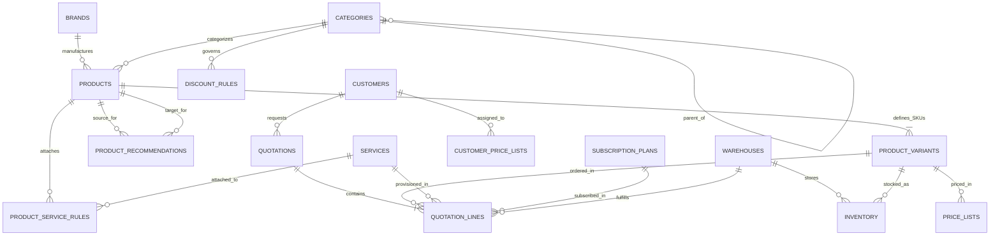

# DealFlow360 — Production-Quality Enterprise IT Hardware Seed Dataset

## 1. Executive Summary & Dataset Purpose

This dataset provides a complete, relationally consistent, synthetic enterprise IT procurement data suite designed specifically for **DealFlow360**, an enterprise B2B Sales Operations and CPQ (Configure, Price, Quote) platform.

The data models an authentic Indian enterprise technology distributor and system integrator anchored around the **Ahmedabad Enterprise Distribution Center (`AMD-DC-01`)** in Gujarat, India, complemented by regional fulfillment hubs in Mumbai (`BOM-DC-01`), Bengaluru (`BLR-DC-01`), Delhi NCR (`DEL-DC-01`), and Hyderabad (`HYD-DC-01`).

All prices, specifications, part numbers, customer profiles, discount governance thresholds, upsell rules, and warehouse allocations reflect real-world commercial hardware procurement standards in India (INR).

---

## 2. Dataset Entity Overview & Record Counts

| CSV File | Entity Description | Record Count | Primary Key | Key Relationships / Foreign Keys |
|---|---|:---:|---|---|
| [`brands.csv`](file:///c:/Users/Krishna/Desktop/odoo/seed-data/brands.csv) | Enterprise hardware OEMs and vendors | **30** | `brand_id` | Referenced by `products.brand` |
| [`categories.csv`](file:///c:/Users/Krishna/Desktop/odoo/seed-data/categories.csv) | Hierarchical product taxonomy (4 Parent + 14 Leaf) | **18** | `category_id` | Self-referencing `parent_category_id` |
| [`warehouses.csv`](file:///c:/Users/Krishna/Desktop/odoo/seed-data/warehouses.csv) | Primary Ahmedabad DC + 4 Regional Fulfillment Hubs | **5** | `warehouse_id` | Referenced by `inventory`, `quotation_lines` |
| [`products.csv`](file:///c:/Users/Krishna/Desktop/odoo/seed-data/products.csv) | Unique enterprise IT hardware models | **182** | `product_id` | `category_id`, `subcategory_id` |
| [`product_variants.csv`](file:///c:/Users/Krishna/Desktop/odoo/seed-data/product_variants.csv) | Sellable SKUs with CPU/RAM/Storage/GPU specs | **366** | `variant_id` | `product_id` |
| [`inventory.csv`](file:///c:/Users/Krishna/Desktop/odoo/seed-data/inventory.csv) | Live stock, reserved, incoming, and backorders | **385** | `inventory_id` | `warehouse_id`, `variant_id` |
| [`price_lists.csv`](file:///c:/Users/Krishna/Desktop/odoo/seed-data/price_lists.csv) | Multi-tier price lists (Standard, SMB, Ent, Strat) | **1,464** | `(price_list_id, product_variant_id)` | `product_variant_id` |
| [`customer_price_lists.csv`](file:///c:/Users/Krishna/Desktop/odoo/seed-data/customer_price_lists.csv) | Mapping customers to specific commercial price tiers | **40** | `customer_price_id` | `customer_id`, `price_list_id` |
| [`discount_rules.csv`](file:///c:/Users/Krishna/Desktop/odoo/seed-data/discount_rules.csv) | Approval hierarchy, ceilings & minimum gross margins | **28** | `discount_rule_id` | `category_id` |
| [`customers.csv`](file:///c:/Users/Krishna/Desktop/odoo/seed-data/customers.csv) | Synthetic Indian B2B enterprise accounts | **40** | `customer_id` | Referenced by `quotations`, `customer_price_lists` |
| [`product_recommendations.csv`](file:///c:/Users/Krishna/Desktop/odoo/seed-data/product_recommendations.csv) | Upsell, cross-sell, and attachment rules | **174** | `recommendation_id` | `source_product_id`, `recommended_product_id` |
| [`services.csv`](file:///c:/Users/Krishna/Desktop/odoo/seed-data/services.csv) | IT deployment, imaging, networking & migration | **12** | `service_id` | Referenced by `quotation_lines`, `product_service_rules` |
| [`subscription_plans.csv`](file:///c:/Users/Krishna/Desktop/odoo/seed-data/subscription_plans.csv) | Recurring AMC, Cloud Backup, SOC & MDM plans | **8** | `plan_id` | Referenced by `quotation_lines` |
| [`product_service_rules.csv`](file:///c:/Users/Krishna/Desktop/odoo/seed-data/product_service_rules.csv) | Automatic service attachment recommendations | **106** | `rule_id` | `product_id`, `service_id` |
| [`quotations.csv`](file:///c:/Users/Krishna/Desktop/odoo/seed-data/quotations.csv) | Sample commercial proposals across lifecycle stages | **44** | `quotation_id` | `customer_id` |
| [`quotation_lines.csv`](file:///c:/Users/Krishna/Desktop/odoo/seed-data/quotation_lines.csv) | Hardware, service, and subscription order lines | **152** | `line_id` | `quotation_id`, `product_variant_id`, `service_id`, `subscription_plan_id`, `fulfillment_warehouse_id` |

---

## 3. Entity Relationship Architecture



---

## 4. Warehouse Network & Ahmedabad Primary Hub

### Primary Distribution Center
- **Code**: `AMD-DC-01`
- **Name**: Ahmedabad Enterprise Distribution Center
- **Location**: Ahmedabad, Gujarat, India (Capacity: 75,000 units)
- **Warehouse Manager**: Rajesh Patel
- **Function**: Central consolidation depot housing stock across all 366 sellable variants.

### Regional Supporting Warehouses
- `WH-002` / `BOM-DC-01`: Mumbai Western Regional Logistics Hub (Mumbai, MH)
- `WH-003` / `BLR-DC-01`: Bengaluru Tech Fulfillment Depot (Bengaluru, KA)
- `WH-004` / `DEL-DC-01`: Delhi NCR Enterprise Supply Hub (Gurugram, HR)
- `WH-005` / `HYD-DC-01`: Hyderabad Cyber Logistics Center (Hyderabad, TS)

---

## 5. Product Categories & Taxonomy

The catalog spans **182 unique products** structured across 4 top-level divisions and 14 enterprise subcategories:

1. **Computing (`CAT-COMP`)**
   - `CAT-LAP` (Business Laptops): Dell Latitude 5440/7440, ThinkPad T14/X1 Carbon, HP EliteBook 840 G10, MacBook Pro M3.
   - `CAT-DSK` (Business Desktops): Dell OptiPlex 7010 (SFF/Micro/Tower/AIO), HP Pro 400, ThinkCentre M70s/Tiny.
   - `CAT-WKS` (Workstations): Dell Precision 3660/5860/7960, HP Z2/Z4/Z8 Fury, ThinkStation P3/P5/PX.
2. **Infrastructure (`CAT-INFRA`)**
   - `CAT-SRV` (Servers): Dell PowerEdge R660/R760/T360, HPE ProLiant DL360/DL380 Gen11, ThinkSystem SR650 V3.
   - `CAT-NET` (Networking): Cisco Catalyst 9200L/9300, Aruba CX 6100/6200F, Ubiquiti UniFi Pro, FortiGate 60F/100F.
   - `CAT-STO` (Storage): Synology DS923+/RS2423+, QNAP TS-464, WD Ultrastar 16TB/20TB, Samsung PM893/PM1733 NVMe.
   - `CAT-UPS` (UPS & Power): APC Smart-UPS 1500VA/3kVA/5kVA/10kVA Online Double-Conversion, Eaton 9PX, Vertiv GXT5.
3. **Mobility (`CAT-MOB`)**
   - `CAT-SMP` (Smartphones): Apple iPhone 15/15 Pro/15 Pro Max, Samsung Galaxy S24/S24 Ultra/A55, Google Pixel 8 Pro.
   - `CAT-TAB` (Tablets): iPad 10th Gen, iPad Air M2, iPad Pro M4, Galaxy Tab S9, Tab Active4 Pro Rugged.
4. **Peripherals & Collaboration (`CAT-PERIPH`)**
   - `CAT-MON` (Monitors): Dell P2422H/P2723DE/U3223QE 4K, HP E24 G4, ThinkVision T27h USB-C Hub.
   - `CAT-PRN` (Printers): HP LaserJet Pro M404dn/M428fdw, Canon imageCLASS/imageRUNNER A3, Brother HL-L6400DW.
   - `CAT-ACC` (Accessories): Dell WD19S/WD22TB4 Docks, Logitech MX Master 3S, Jabra Evolve2 65, GaN 120W Chargers.
   - `CAT-COL` (Collaboration Equipment): Logitech Rally Bar/MeetUp, Poly Studio X50/X70, Barco ClickShare CX-30/CX-50.
   - `CAT-SEC` (Cabling & Optics): Cisco 10G SFP+ SR/LR, Aruba 10G DAC cables, Belkin Cat6A 10-packs, Server Rail Kits.

---

## 6. Commercial Logic: Pricing, Tiers & Discount Governance

### Pricing Logic
- **Base Pricing (INR)**: Real-world Indian commercial market pricing.
- **Selling Price > Cost Price**: Every variant maintains a positive gross margin.
  - Hardware Gross Margins: 8% to 28%
  - Enterprise Networking & Storage: 18% to 35%
  - Peripherals & Accessories: 25% to 48%
  - Services: 38% to 45%

### Customer Tiers & Price Lists
1. **Standard (`PL-STD`)**: Base commercial list pricing (0% discount baseline).
2. **SMB (`PL-SMB`)**: Small-to-midsize business discount (~4% to 7% off standard list).
3. **Enterprise (`PL-ENT`)**: Corporate volume pricing (~9% to 14% off standard list).
4. **Strategic (`PL-STRAT`)**: Key account & partner pricing (~16% to 22% off standard list).

### Discount Governance Hierarchy
When a sales representative quotes discounts exceeding tier ceilings, DealFlow360 approval workflows are triggered:
- **Level 1 (`L1_SALES_LEAD`)**: For minor concessions (3% to 8%).
- **Level 2 (`L2_SALES_DIRECTOR`)**: For enterprise hardware concessions (12% to 15%).
- **Level 3 (`L3_VP_COMMERCIAL`)**: For strategic deals exceeding standard thresholds (18% to 22%).
- **Level 4 (`L4_CFO`)**: For deals breaching minimum gross margin safety floors.

---

## 7. Demo Scenarios Embedded in Dataset

The dataset embeds 7 exact demo scenarios:

### Scenario 1 / Demo A — Excessive Discount Approval Workflow
- **Quotation**: `QT-2026-0001`
- **Customer**: `CUST-001` (Arvind Industrial Systems Pvt Ltd, Enterprise Tier)
- **Bill of Materials**: 100x Dell Latitude 5440 Laptops + 100x Dell WD19S Docks + 20x Dell P2422H Displays + Zero-Touch Deployment Service.
- **Trigger**: Rep requested 22.0% discount on laptops (exceeds Enterprise Hardware ceiling of 15.0%).
- **Result**: `status = "Pending Approval"`, `approval_status = "Pending L2_SALES_DIRECTOR Approval"`, `deal_health = "Action Required"`.

### Scenario 2 / Demo C — Multi-Warehouse Split Fulfillment
- **Quotation**: `QT-2026-0002`
- **Customer**: `CUST-004` (Western Grid Technologies Pvt Ltd)
- **Bill of Materials**: 100x Lenovo ThinkPad T14 Gen 4 (`VAR-0008`).
- **Inventory State**: Ahmedabad (`WH-001`) has 60 available units; Mumbai (`WH-002`) has 40 available units.
- **Result**:
  - Line 1: 60 units fulfilled from `WH-001` (`fulfillment_status = "ALLOCATED"`).
  - Line 2: 40 units fulfilled from `WH-002` (`fulfillment_status = "PARTIAL_SPLIT"`).

### Scenario 3 — Factory Backorder Allocation
- **Quotation**: `QT-2026-0003`
- **Customer**: `CUST-010` (Bharat Financial Analytics Ltd)
- **Bill of Materials**: 50x Dell PowerEdge R760 2U Enterprise Servers (`VAR-0050`).
- **Inventory State at `AMD-DC-01`**:
  - `available_quantity = 8`
  - `incoming_quantity = 20` (ETA 7 days)
  - `backorder_quantity = 22`
  - `inventory_status = "BACKORDER"`
- **Result**: Quotation line marked as `fulfillment_status = "BACKORDERED"`.

### Scenario 4 / Demo D — Hybrid Billing (One-Time + Recurring AMC + SaaS)
- **Quotation**: `QT-2026-0004`
- **Customer**: `CUST-002` (Gujarat Precision Engineering Pvt Ltd)
- **Bill of Materials**:
  - 20x HP EliteBook 840 G10 (One-Time Hardware)
  - 20x HP E24 G4 Displays (One-Time Hardware)
  - Laptop Zero-Touch Imaging (One-Time Service)
  - Comprehensive Enterprise AMC with 4hr SLA (Recurring Annual Subscription)
  - Managed Cloud Backup BaaS 1TB (Recurring Monthly Subscription)
- **Result**: Quotation lines feature mixed `ONE_TIME` and `RECURRING` lines with proper frequency tracking.

### Scenario 5 / Demo E — Customer Portal Negotiation Restarts Approval
- **Quotation**: `QT-2026-0005`
- **Customer**: `CUST-003` (Sabarmati Logistics & Supply Chain Ltd)
- **Context**: Quotation in `Under Negotiation` for 35x Samsung Tab Active4 Pro rugged tablets.
- **Trigger**: Customer counter-offered requesting 18.5% discount (exceeds 8.0% Mobility discount ceiling).
- **Result**: `approval_status = "Pending Approval"`, `deal_health = "Attention Needed"`.

### Demo F — Stalled Deal Analytics (Deal Health = At Risk)
- **Quotation**: `QT-2026-0006`
- **Customer**: `CUST-027` (Royal Orchid Hospitality Group)
- **Context**: Proposal sent 45 days ago; valid_until date expired with zero customer interactions.
- **Result**: `status = "Sent"`, `deal_health = "At Risk"`.

### Demo G — Sales Rep Discount Anomaly Detection
- **Quotation**: `QT-2026-0007`
- **Customer**: `CUST-014` (Karnavati Tech Park Operations Pvt Ltd, SMB Tier)
- **Bill of Materials**: 15x Cisco Catalyst 9200L 48-Port PoE+ Switches.
- **Trigger**: Rep entered 28.5% discount (peer group median discount for SMB networking is 6.5%, max allowed is 8.0%).
- **Result**: `status = "Pending Approval"`, `approval_status = "Flagged - Discount Anomaly"`, `deal_health = "Review Required"`.

---

## 8. Data Validation & Integrity Verification

To verify that the dataset contains zero broken references, zero duplicate keys, and valid calculations, run:

```bash
python validate_seed_data.py
```

### Expected Output:
```text
========================================
DEALFLOW360 DATA VALIDATION
========================================
Products:                    182
Variants:                    366
Customers:                    40
Warehouses:                    5
Inventory Records:           385
Recommendations:             174
Quotations:                   44
Quotation Lines:             152
Price List Entries:         1464
Product-Service Rules:       106
----------------------------------------
Foreign Key Errors:            0
Duplicate IDs:                 0
Duplicate SKUs:                0
Invalid Prices:                0
Invalid Inventory:             0
Invalid Dates:                 0
Invalid Discount Rules:        0
Invalid Tax Rates:             0
Invalid Customer Tiers:        0
Invalid Categories:            0
----------------------------------------
STATUS: PASS
========================================
```

---

## 9. Database Import Instructions

To load these files into a relational database (PostgreSQL, MySQL, SQLite, or Odoo ORM), follow this dependency order:

1. `brands.csv`
2. `categories.csv`
3. `warehouses.csv`
4. `services.csv`
5. `subscription_plans.csv`
6. `discount_rules.csv`
7. `customers.csv`
8. `products.csv`
9. `product_variants.csv`
10. `inventory.csv`
11. `price_lists.csv`
12. `customer_price_lists.csv`
13. `product_recommendations.csv`
14. `product_service_rules.csv`
15. `quotations.csv`
16. `quotation_lines.csv`
